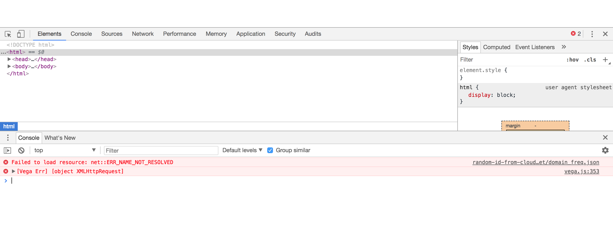
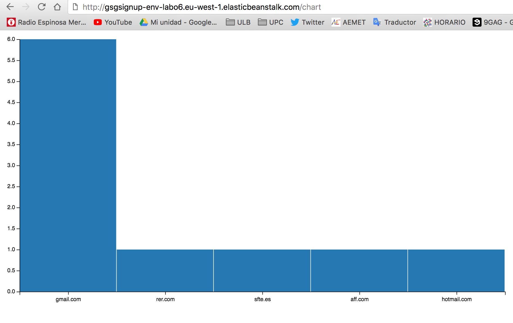
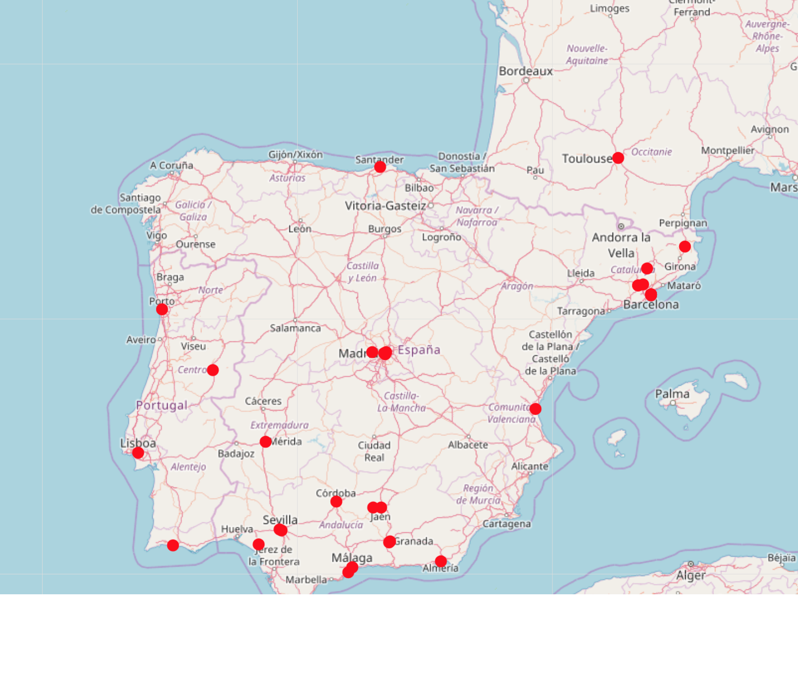
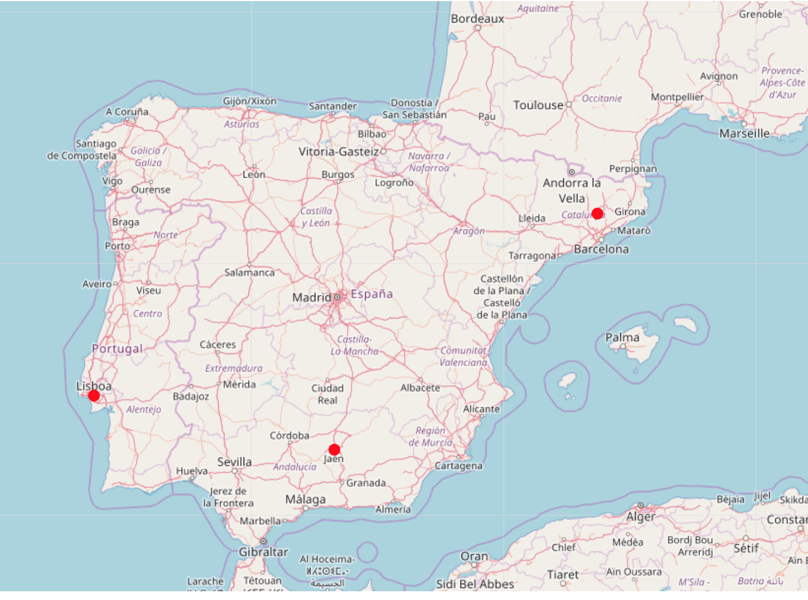
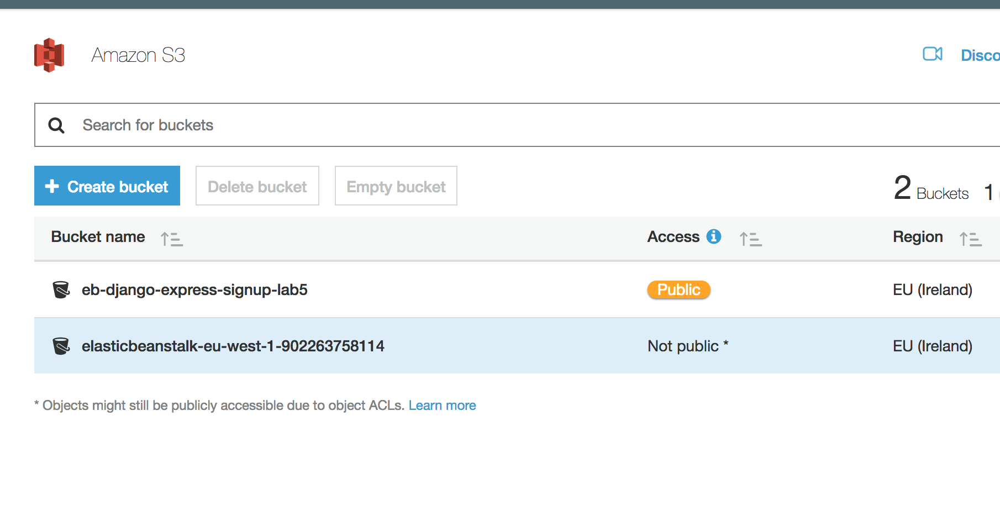

# CLOUD-COMPUTING-CLASS-2018 – LAB06

 
* Sergio Ruiz: __sergiers@opendeusto.es__
* Dagoberto Herrera: __dagobertoherreramurillo@live.com__

---


Before starting the server, we are going to modify our code, in order to add the new global variable for using CDN, in `settings.py`:

```
CLOUD_FRONT = os.environ['CLOUD_FRONT'] == 'True'


if CLOUD_FRONT:
    DEFAULT_FILE_STORAGE = 'storages.backends.s3boto3.S3Boto3Storage'
    STATICFILES_STORAGE = 'storages.backends.s3boto3.S3Boto3Storage'
    AWS_STORAGE_BUCKET_NAME = "eb-django-express-signup-E3PCF4PWH95ISE"
    AWS_S3_CUSTOM_DOMAIN = 'd284tzts9xyjn.cloudfront.net'
```

And then, we export the global variable (remember that this only applies for the ACTUAL terminal sesion):

```
export CLOUD_FRONT='True'
```

By the way, here are the other variables we are using:

```
export NEW_SIGNUP_TOPIC=''
export AWS_REGION='eu-west-1'
export STARTUP_SIGNUP_TABLE='gsg-signup-table'
export DEBUG='True'

```


# Task 6.1: How to provide your services through a REST API?

Now we modify the code and [we create the view for the charts](https://github.com/CCBDA-UPC/Assignments-2018/blob/master/Lab06.md#task-61--how-to-provide-your-services-through-a-rest-api).  After adding the extra code lines and check that everything works locally, we open again an Amazon S3 bucket, and we create a CDN (in our case, only europe and america), and we upload the static content `domain_freq.json`. Finally, we modify the code in order to get this JSON from the CDN... 

...But we cannot see anything. What is happening? We open web inspector, and check the errors:





## About cors:

[Cross-origin resource sharing (CORS)](https://docs.aws.amazon.com/AmazonS3/latest/dev/cors.html
) is a mechanism that allows restricted resources (e.g. fonts, css etc) on a web page to be requested from another domain outside the domain from which the first resource was served. A web page may freely embed static content. Certain "cross-domain" requests, are forbidden by default by the same-origin security policy. CORS defines a way in which a browser and server can interact to determine whether or not it is safe to allow the cross-origin request. It allows for more freedom and functionality than purely same-origin requests, but is more secure than simply allowing all cross-origin requests. 

To solve this problem in our code, we just need to add the following: We edit the permissions of the S3 bucket, for adding * to `AllowedHeader`

```
<?xml version="1.0" encoding="UTF-8"?>
<CORSConfiguration xmlns="http://s3.amazonaws.com/doc/2006-03-01/">
<CORSRule>
    <AllowedOrigin>*</AllowedOrigin>
    <AllowedMethod>GET</AllowedMethod>
    <MaxAgeSeconds>3000</MaxAgeSeconds>
    <AllowedHeader>*</AllowedHeader>
</CORSRule>
</CORSConfiguration>
```


Here is how the chart looks like:




# Task 6.2: How to provide our service combined with third-party services?

We create our `Twitterlistener.py` and we select our area for the tweets. We choosed Spain.

Then we add the code for the map following the [turorial](https://github.com/CCBDA-UPC/Assignments-2018/blob/master/Lab06.md#task-62-how-to-provide-our-service-combined-with-third-party-services).

We also complete the Tweets class, in order to retrieve the tweets from the DynamoDB:

```
class Tweets(models.Model):
    def get_tweets(self):
        try:
            dynamodb = boto3.resource('dynamodb', region_name=AWS_REGION)
            table = dynamodb.Table('twitter-geo')
        except Exception as e:
            logger.error(
                'Error connecting to database table: ' + (e.fmt if hasattr(e, 'fmt') else '') + ','.join(e.args))
            return None


        response = table.scan(
            ReturnConsumedCapacity='TOTAL',
        )


        if response['ResponseMetadata']['HTTPStatusCode'] == 200:
            return response['Items']
        logger.error('Unknown error retrieving items from database.')
        return None
```


This `response['Items']` is a JSON that is passed to the `views.py`. This class will convert the data into a geoJson. 

The result is something like this:




### Getting things via GET

## Q62a:

In order to simply apply filters, we can use the GET method to obtain this filtes. 

We call get method and we obtain the dates. Then we parse it:

```
fromDate = request.GET.get('from', '')
toDate = request.GET.get('to', '')
...
for tweet in tweets.get_tweets(fromDate, toDate):
...
```


And in the model:

```
        f = "%a %b %d %H:%M:%S +0000 %Y"
        s = "%d-%m-%Y"
        fromDateTime = datetime.strptime(fromDate, s)
        toDateTime = datetime.strptime(toDate, s)


        filteredRespones = []
        for i in response['Items']:
            tweetDate = datetime.strptime(i['created_at'], f)
            if(fromDateTime <= tweetDate <= toDateTime):
                filteredRespones.append(i)

        if response['ResponseMetadata']['HTTPStatusCode'] == 200:
            return filteredRespones
        logger.error('Unknown error retrieving items from database.')
        return None

```

What we do is to take only those tweets that meet the filter. Note that we manually modified the year of some tweets to have some data. The result looks like this:




### Q62b:

Because our own application are stored into a S3 bucket, we can simply change the CDN to point to the JSON stored into our existing bucket:




### Q62c:

For executing a task in background, we are going to use [subprocess](https://docs.python.org/3/library/subprocess.html). With this method, we can simply call the `TwitterListener` script from the `__init__.py`


```
import subprocess
import sys

p = subprocess.Popen([sys.executable, 'TwitterListener.py'],
                                    stdout=subprocess.PIPE,
                                    stderr=subprocess.STDOUT)
```


# Task 6.3: Advanced Analytics as a Service in the Cloud (optional task)

TO DO

